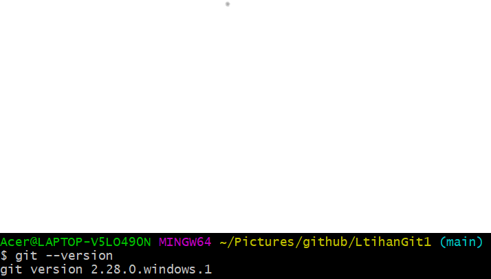
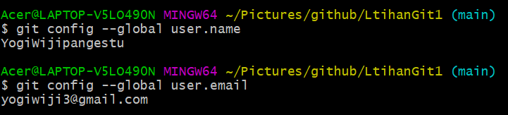
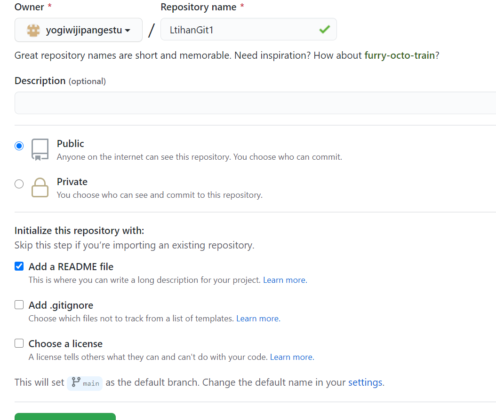
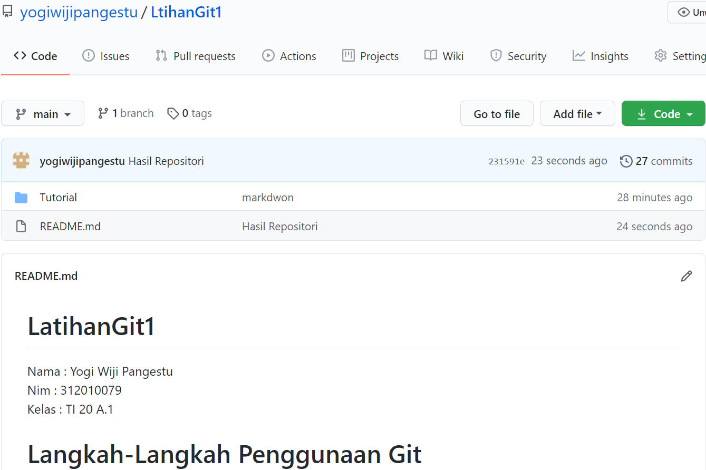
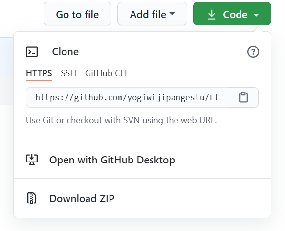
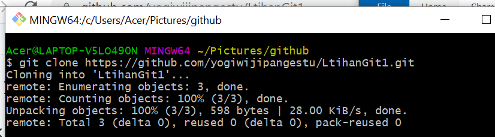
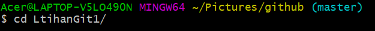
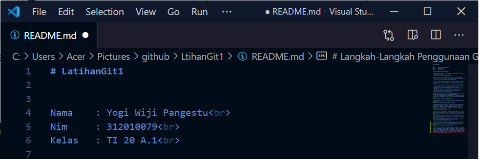
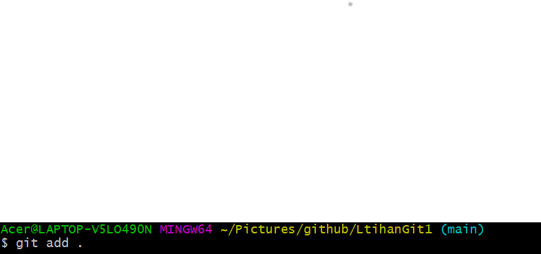
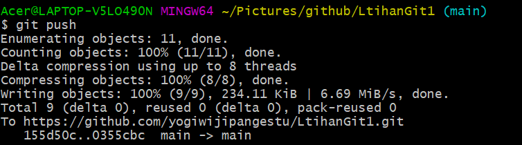

# LatihanGit1

Nama    : Yogi Wiji Pangestu 
Nim     : 312010079 
Kelas   : TI 20 A.1 

# Langkah-Langkah Penggunaan Git

* Download Git terlebih dahulu,dengan link berikut: [click here](https://git-scm.com)

* Setelah file terdownload,silakan lakukan instalasi dengan referensi berikut ini: [click here](https://git-install-guide.com)

* Setelah installasi selesai,buka software **GitBash** pada menu di Windows,dan lakukan pengecekan versi,dengan mengetik syntax berikut:
 `git --version`  

 * Jika muncul tampilan git version,berarti git sudah berhasil di install dan bisa digunakan.Langkah pertama kita harus mengkonfigurasi user nama dan email di Git,mengetik **syntax** berikut:
 `git config --global user.name"Masukan Nama Anda disini"git config --global user.email"Masukan Email Anda disini"

* Buat akun di **GitHub**,seperti contoh dibawah ini.Dan lakukan Verifikasi akun melalui email yang sudah terdaftar.
* Jika akun GitHub sudah selesai dibuat dan di verifikasi,proses selanjutnya silahkan buat **Repository** seperti gambar dibawah ini:

* jika repository sudah dibuat maka akan mucul tampilan seperti dibawah ini:

* Pembuatan akun dan repository pada Github telah selesai,saat ini akan kita lakukan untuk *me-remote* repository GitHub pada GitBash lokal.Bagaimana caranya?Langkah pertama kita harus menyalin link URL git kita di GitHub,dengan cara tekan tombol **code** lalu klik *copy*.

* Setelah *Link URL* git kita tercopy,silahkan buka File Explore pada windows,kemuadian pilih folder dimana kita akan mendownload Repository dari GitHub ke lokal.Kemudian Klik Kanan,Pilih **Git Bash Here**.
* *Pop Up*Command Prompt**(CMD)**akan terbuka.Pada proses ini kita akan melakukan download file repository yang tadi dibuat,dengan mengetik *syntax*berikut:
`git clone [URL] Pada contohnya,saya akan memasukan *git clone*
https://github.com/yogiwijipangestu/LtihanGit1.git

* Setelah Proses Cloning selesai,pada saat ini kita masih pada folder awal(master),Kita harus masuk kedalam folder yang telah dicloning tadi yaitu *Latihan*VCS dengan mengetikkan *syntax* berikut:

 
* Saat ini kita sudah masuk kedalam folder *LatihanVCS*, Silahkan edit file **README.md** yang ada di File Explorer. Bisa menggunakan Text Editor *(Sublime Text, Notepad, Notepad++, Visual Studio Code)*. Edit sesuai dengan keinginan. Aturan file .md (Markdown) bisa dilihat di Link berikut ini : [click-here](https://guides.github.com/features/mastering-markdown/) 

Setelah file **README.md** diedit, silahkan Simpan file tersebut dengan cara **CTRL+S** atau **File -> Save**

* Langkah selanjutnya setelah file disimpan, kita kembali pada App Git Bash (CMD). Ketik pada Git Bash seperti berikut ini :  
`git add`

* Setelah selesai melakukan `git add` . langkah berikutnya kita akan melakukan *commit*. Fungsi commit adalah untuk menyimpan perubahan yang dilakukan, tetapi tidak ada perubahan pada remote repository. Ketik pada App Git Bash seperti berikut ini :  
`git commit "Update README.md`

* Git *commit* telah selesai di lakukan. Untuk saat ini akan melakuka Git Push, *Git Push* berfungsi untuk mengirimkan perubahan file setelah di commit ke remote repository. Silahkan ketik pada App Git Bash seperti berikut :

`Git Push`

* Semua proses telah selesai, silahkan kembali ke *Web Browser* untuk melihat perubahan yang telah di *commit* dan *push* dari remote.  

`Hasil Rpositori`

